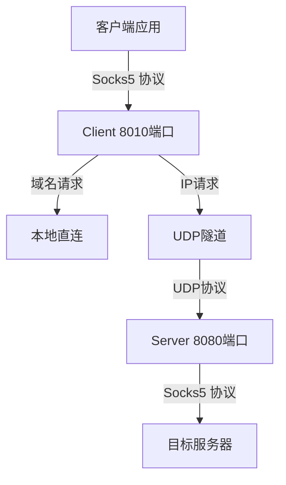
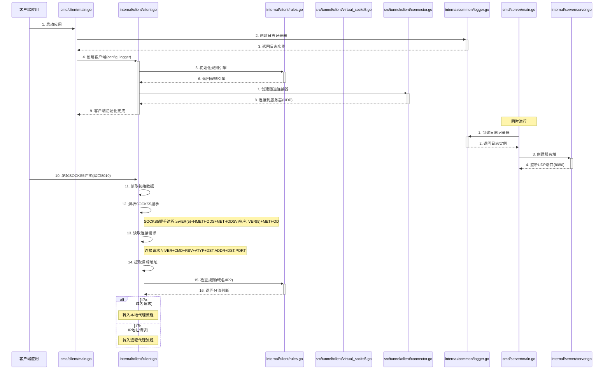
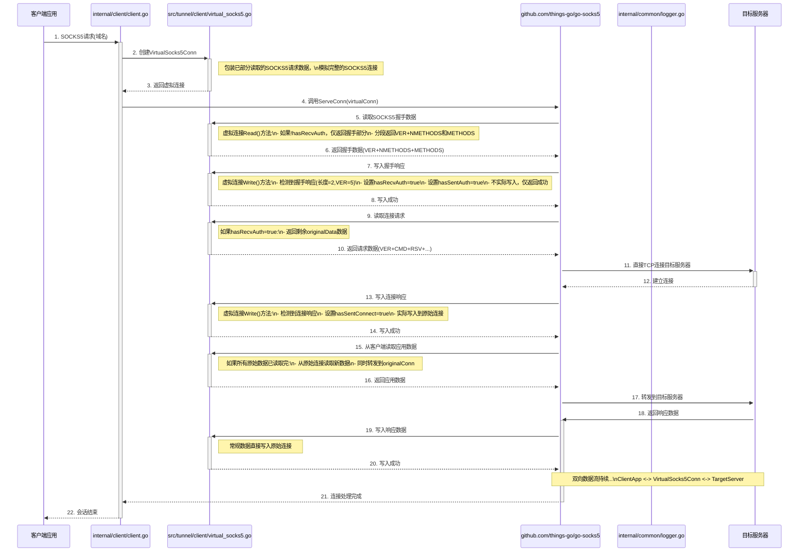
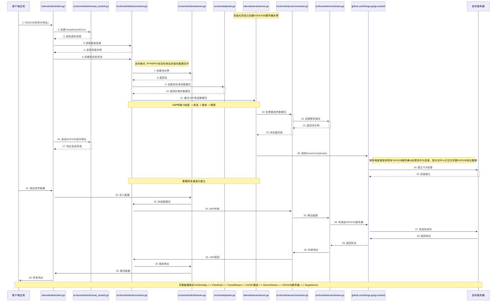

# UDP隧道Socks5代理系统设计方案

**记忆ID: PROXY-CS3-UDP-TUNNEL-SOCKS5-20240710**

## 1. 系统概述

本系统实现了一个基于UDP隧道的Socks5代理服务，具有以下特点：

- 客户端接收Socks5协议数据，对外暴露8010端口
- 服务端对外暴露8080端口
- 客户端与服务端之间通过UDP建立通道
- 域名请求在客户端本地直连转发，IP地址请求通过UDP隧道代理转发
- 单一UDP连接支持多请求多路复用

## 2. 系统架构



### 2.1 核心组件

1. **客户端**
   - 接收并解析Socks5请求
   - 实现域名/IP分流逻辑
   - 维护与服务端的UDP隧道连接
   - 使用VirtualSocks5Conn处理回放数据

2. **服务端**
   - 监听UDP端口接收隧道连接
   - 管理多客户端连接
   - 处理隧道数据流转发到目标服务器

3. **隧道通信**
   - 定义数据包格式
   - 实现可靠传输机制
   - 支持流的多路复用

4. **虚拟Socks5连接**
   - 处理已部分读取的Socks5数据
   - 模拟Socks5协议握手过程

## 3. 目录结构

```
proxy-cs3/
├── go.mod
├── go.sum
├── cmd/
│   ├── client/
│   │   └── main.go     # 客户端入口
│   └── server/
│       └── main.go     # 服务端入口
├── internal/
│   ├── client/
│   │   ├── client.go   # 客户端实现
│   │   └── rules.go    # 规则引擎
│   ├── server/
│   │   └── server.go   # 服务端实现
│   └── common/
│       └── logger.go   # 日志实现
└── src/
    ├── tunnel/
    │   ├── interface_connector.go       # 连接器接口
    │   ├── base_connector.go  # 基础连接器
    │   ├── base_stream.go          # 数据流基础实现
    │   ├── packet.go          # 数据包定义
    │   ├── types.go           # 常量与类型
    │   ├── client/            # 客户端实现
    │   │   ├── connector.go   # 客户端连接器
    │   │   └── stream.go      # 客户端流
    │   │   ├── virtual_socks5.go
    │   │   └── virtual_socks5_test.go
    │   └── server/            # 服务端实现
    │       ├── connector.go   # 服务端连接器
    │       └── stream.go      # 服务端流

```

## 4. 详细数据流转

### 4.1 初始化与连接建立阶段



### 4.2 本地代理转发流程（域名请求）



### 4.3 远程代理转发流程（IP地址请求）



## 5. 核心设计要点

### 5.1 VirtualSocks5Conn设计

VirtualSocks5Conn是一个模拟SOCKS5连接的特殊组件，它可以处理已部分读取的SOCKS5协议数据：

```go
// VirtualSocks5Conn 虚拟的SOCKS5连接
type VirtualSocks5Conn struct {
    net.Conn                    // 原始连接
    readBuf        bytes.Buffer // 读取缓冲区
    hasSentAuth    bool         // 是否已发送认证响应
    hasSentConnect bool         // 是否已发送连接响应
    hasRecvAuth    bool         // 是否已收到认证响应
    originalData   []byte       // 原始请求数据
    currentPos     int          // 当前读取位置
    log            Logger       // 日志记录器
    closed         bool         // 连接是否已关闭
    mu             sync.Mutex   // 互斥锁
    originalConn   net.Conn     // 原始连接，用于写回数据
}
```

它的关键功能：
- 分段提供SOCKS5协议数据，模拟完整握手过程
- 智能处理SOCKS5响应，确保协议正确性
- 读取完预缓存数据后，透明传递底层连接的数据

### 5.2 隧道数据包设计

隧道数据包定义了客户端和服务端之间通信的协议格式：

```go
// TunnelPacket 隧道数据包
type TunnelPacket struct {
    Header PacketHeader
    Payload []byte
}

// PacketHeader 数据包头部
type PacketHeader struct {
    Type     PacketType // 数据包类型
    Version  uint8      // 协议版本
    StreamID string     // 流ID
    Length   uint16     // 负载长度
}
```

数据包类型：
- **握手包(HandshakePacket)**: 建立连接时使用
- **数据包(DataPacket)**: 传输实际业务数据
- **目标请求包(TargetRequestPacket)**: 指定目标地址
- **关闭包(ClosePacket)**: 关闭流或连接
- **心跳包(HeartbeatPacket)**: 保持连接活跃
- **错误包(ErrorPacket)**: 传递错误信息

### 5.3 规则分流机制

系统实现了一个简单但高效的分流规则：
- 域名请求本地直连，减少延迟
- IP地址请求通过隧道代理转发
- 支持配置自定义域名规则，包括通配符匹配

```go
// ShouldDirectConnect 判断是否应该直连
func (r *RuleEngine) ShouldDirectConnect(addr string) bool {
    host, _, err := net.SplitHostPort(addr)
    if err != nil {
        return r.defaultDirect
    }
    
    // 判断是否是IP地址
    ip := net.ParseIP(host)
    if ip != nil {
        // IP地址使用代理
        return false
    }
    
    // 域名检查规则
    for _, rule := range r.domainRules {
        if matchDomain(host, rule) {
            return true
        }
    }
    
    return r.defaultDirect
}
```

### 5.4 单UDP连接多路复用

系统在单一UDP连接上实现了多个客户端请求的多路复用：
- 每个请求分配唯一流ID
- 数据包中包含流ID，用于区分不同请求
- 服务端为每个流单独处理目标连接

## 6. 部署和使用

### 6.1 编译

```bash
# 编译客户端
go build -o client ./cmd/client

# 编译服务端
go build -o server ./cmd/server
```

### 6.2 配置

客户端配置示例 (config.yaml):
```yaml
client:
  local_port: 8010
  server_addr: "example.com:8080"
  timeout: 60s
  rules:
    direct_domains:
      - "*.baidu.com"
      - "*.qq.com"
    default_direct: true
```

### 6.3 运行

启动服务端:
```bash
./server -port 8080
```

启动客户端:
```bash
./client -config config.yaml
```

使用代理:
```bash
# 设置SOCKS5代理
export http_proxy=socks5://127.0.0.1:8010
export https_proxy=socks5://127.0.0.1:8010

# 测试
curl https://www.example.com
```

## 7. 总结

本设计方案实现了一个高效的UDP隧道Socks5代理系统，具有以下优势：

1. **智能分流**: 域名本地直连，IP地址隧道代理，平衡性能与隐私
2. **资源高效**: 单一UDP连接支持多请求多路复用
3. **协议兼容**: 完全兼容标准SOCKS5协议
4. **模块化设计**: 清晰的接口定义和组件职责分离

该系统适用于需要在确保网络安全性的同时，优化性能和资源利用的场景。

---

**记忆ID: PROXY-CS3-UDP-TUNNEL-SOCKS5-20240710** 